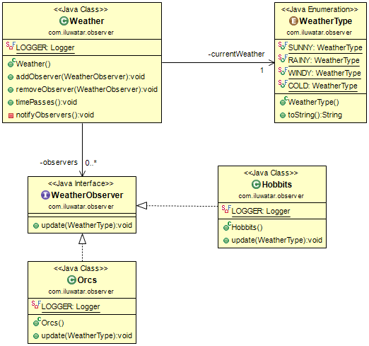

## Also known as
Dependents, Publish-Subscribe

## Intent
Define a one-to-many dependency between objects so that when one object changes state, all its dependents are notified 
and updated automatically.

## Explanation

Real world example

> In a land far away lives the races of hobbits and orcs. Both of them are mostly outdoors so they closely follow the changes in weather. One could say that they are constantly observing the weather.        

In plain words

> Register as an observer to receive state changes in the object.   

Wikipedia says

> The observer pattern is a software design pattern in which an object, called the subject, maintains a list of its dependents, called observers, and notifies them automatically of any state changes, usually by calling one of their methods.

**Programmatic Example**

Let's first introduce the weather observer interface and our races, orcs and hobbits.

```java
public interface WeatherObserver {

  void update(WeatherType currentWeather);
}

public class Orcs implements WeatherObserver {

  private static final Logger LOGGER = LoggerFactory.getLogger(Orcs.class);

  @Override
  public void update(WeatherType currentWeather) {
    switch (currentWeather) {
      case COLD:
        LOGGER.info("The orcs are freezing cold.");
        break;
      case RAINY:
        LOGGER.info("The orcs are dripping wet.");
        break;
      case SUNNY:
        LOGGER.info("The sun hurts the orcs' eyes.");
        break;
      case WINDY:
        LOGGER.info("The orc smell almost vanishes in the wind.");
        break;
      default:
        break;
    }
  }
}

public class Hobbits implements WeatherObserver {

  private static final Logger LOGGER = LoggerFactory.getLogger(Hobbits.class);

  @Override
  public void update(WeatherType currentWeather) {
    switch (currentWeather) {
      case COLD:
        LOGGER.info("The hobbits are shivering in the cold weather.");
        break;
      case RAINY:
        LOGGER.info("The hobbits look for cover from the rain.");
        break;
      case SUNNY:
        LOGGER.info("The happy hobbits bade in the warm sun.");
        break;
      case WINDY:
        LOGGER.info("The hobbits hold their hats tightly in the windy weather.");
        break;
      default:
        break;
    }
  }
}
```

Then here's the weather that is constantly changing.

```java
public class Weather {

  private static final Logger LOGGER = LoggerFactory.getLogger(Weather.class);

  private WeatherType currentWeather;
  private List<WeatherObserver> observers;

  public Weather() {
    observers = new ArrayList<>();
    currentWeather = WeatherType.SUNNY;
  }

  public void addObserver(WeatherObserver obs) {
    observers.add(obs);
  }

  public void removeObserver(WeatherObserver obs) {
    observers.remove(obs);
  }

  /**
   * Makes time pass for weather.
   */
  public void timePasses() {
    var enumValues = WeatherType.values();
    currentWeather = enumValues[(currentWeather.ordinal() + 1) % enumValues.length];
    LOGGER.info("The weather changed to {}.", currentWeather);
    notifyObservers();
  }

  private void notifyObservers() {
    for (var obs : observers) {
      obs.update(currentWeather);
    }
  }
}
```

Here's the full example in action.

```java
    var weather = new Weather();
    weather.addObserver(new Orcs());
    weather.addObserver(new Hobbits());

    weather.timePasses();
    // The weather changed to rainy.
    // The orcs are dripping wet.
    // The hobbits look for cover from the rain.
    weather.timePasses();
    // The weather changed to windy.
    // The orc smell almost vanishes in the wind.
    // The hobbits hold their hats tightly in the windy weather.
    weather.timePasses();
    // The weather changed to cold.
    // The orcs are freezing cold.
    // The hobbits are shivering in the cold weather.
    weather.timePasses();
    // The weather changed to sunny.
    // The sun hurts the orcs' eyes.
    // The happy hobbits bade in the warm sun.
```

## Class diagram


## Applicability
Use the Observer pattern in any of the following situations

* When an abstraction has two aspects, one dependent on the other. Encapsulating these aspects in separate objects lets you vary and reuse them independently
* When a change to one object requires changing others, and you don't know how many objects need to be changed
* When an object should be able to notify other objects without making assumptions about who these objects are. In other words, you don't want these objects tightly coupled

## Typical Use Case

* Changing in one object leads to a change in other objects

## Real world examples

* [java.util.Observer](http://docs.oracle.com/javase/8/docs/api/java/util/Observer.html)
* [java.util.EventListener](http://docs.oracle.com/javase/8/docs/api/java/util/EventListener.html)
* [javax.servlet.http.HttpSessionBindingListener](http://docs.oracle.com/javaee/7/api/javax/servlet/http/HttpSessionBindingListener.html)
* [RxJava](https://github.com/ReactiveX/RxJava)

## Credits

* [Design Patterns: Elements of Reusable Object-Oriented Software](https://www.amazon.com/gp/product/0201633612/ref=as_li_tl?ie=UTF8&camp=1789&creative=9325&creativeASIN=0201633612&linkCode=as2&tag=javadesignpat-20&linkId=675d49790ce11db99d90bde47f1aeb59)
* [Java Generics and Collections](https://www.amazon.com/gp/product/0596527756/ref=as_li_tl?ie=UTF8&camp=1789&creative=9325&creativeASIN=0596527756&linkCode=as2&tag=javadesignpat-20&linkId=246e5e2c26fe1c3ada6a70b15afcb195)
* [Head First Design Patterns: A Brain-Friendly Guide](https://www.amazon.com/gp/product/0596007124/ref=as_li_tl?ie=UTF8&camp=1789&creative=9325&creativeASIN=0596007124&linkCode=as2&tag=javadesignpat-20&linkId=6b8b6eea86021af6c8e3cd3fc382cb5b)
* [Refactoring to Patterns](https://www.amazon.com/gp/product/0321213351/ref=as_li_tl?ie=UTF8&camp=1789&creative=9325&creativeASIN=0321213351&linkCode=as2&tag=javadesignpat-20&linkId=2a76fcb387234bc71b1c61150b3cc3a7)
